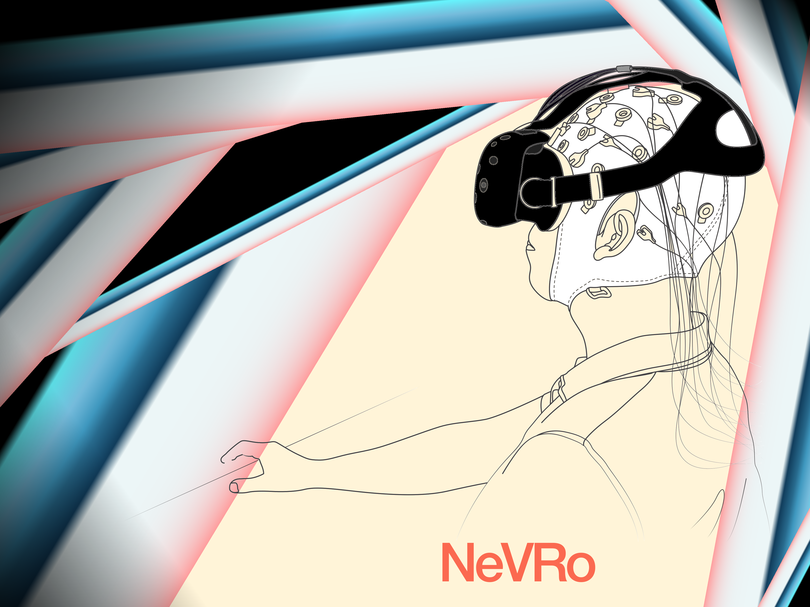

<h1>NeVRo – Neuro Virtual Reality Rollercoasters</h1>

<h2>Decoding subjective emotional arousal from EEG during an immersive Virtual Reality experience</h2>
Code base of: <a href="https://elifesciences.org/articles/64812"> Hofmann*, Klotzsche*, Mariola*, Nikulin, Villringer, & Gaebler. <i>eLife</i>, 2021</a> 
<small>* : equal contribution   </small>

<h2>Introduction</h2>

We used virtual reality (VR) to investigate emotional arousal under naturalistic conditions. 45 subjects experienced virtual roller coaster rides while their neural (EEG) and peripheral physiological (ECG, GSR) responses were recorded. Afterwards, they rated their subject levels of arousal retrospectively on a continuous scale while viewing a recording of their experience.

<h2>Methods</h2>
We tackled the data with three model approaches. The corresponding code can be found in the respective folders.

<h3>SPoC Model</h3>
<a href="https://doi-org.browser.cbs.mpg.de/10.1016/j.neuroimage.2013.07.079">Source Power Comodulation (SPoC)</a> decomposes the EEG signal such that it maximizes the covariance between the power-band of the frequency of interest (here alpha, 8-12Hz) and the target variable (ratings).

<h3>CSP Model</h3>
<a href="https://ieeexplore.ieee.org/document/4408441/">Common Spatial Pattern (CSP)</a> algorithm derives a set of spatial filters to project the EEG data onto compontents whose band-power maximally relates to the prevalence of specified classes (here low and high arousal). 

<h3>LSTM Model</h3>
<a href="https://doi.org/10.1162/neco.1997.9.8.1735">Long Short-Term Memory (LSTM)</a> recurrent neural networks (RNNs) were trained on alpha-frequency components of the recorded EEG signal to predict subjective reports of arousal (ratings). 

<h3>Versions</h3>

###### version 2.1+

`2021`: additional linear model, new cross-validation regime, and further sub-analyses. Encouraged by valuable feedback via this [peer-review](https://hyp.is/go?url=https%3A%2F%2Fwww.biorxiv.org%2Fcontent%2F10.1101%2F2020.10.24.353722v3&group=q5X6RWJ6). This version is the basis of the [eLife publication](https://elifesciences.org/articles/64812).

###### version 2.0

`2018-2020`: preprocessing for models (SPoC, CSP, LSTM) was harmonized, and their evaluation and metrics were adapted accordingly. Plus, a more detailed documentation is available. Code for extended & harmonized version of the study (see [bioRxiv preprint](https://www.biorxiv.org/content/10.1101/2020.10.24.353722v3)).

###### version 1.x
`2017-2018`: Code of two IEEE conference publications:
* <a href="https://ieeexplore.ieee.org/document/8613645"> Hofmann, Klotzsche, Mariola, Nikulin, Villringer, & Gaebler. <i>IEEE AIVR</i>, 2018</a>
* <a href="https://ieeexplore.ieee.org/abstract/document/8446275"> Klotzsche, Mariola, Hofmann, Nikulin, Villringer, & Gaebler. <i>IEEE VR</i>, 2018.</a> [<a href="https://github.com/eioe/NeVRo/tree/klotzsche2018_ieeevr">archived code</a>]

<h3>Collaborators</h3>
<a href="https://github.com/SHEscher">Simon M. Hofmann</a> 
<a href="https://github.com/eioe">Felix Klotzsche</a> 
<a href="https://github.com/langestroop">Alberto Mariola</a>
